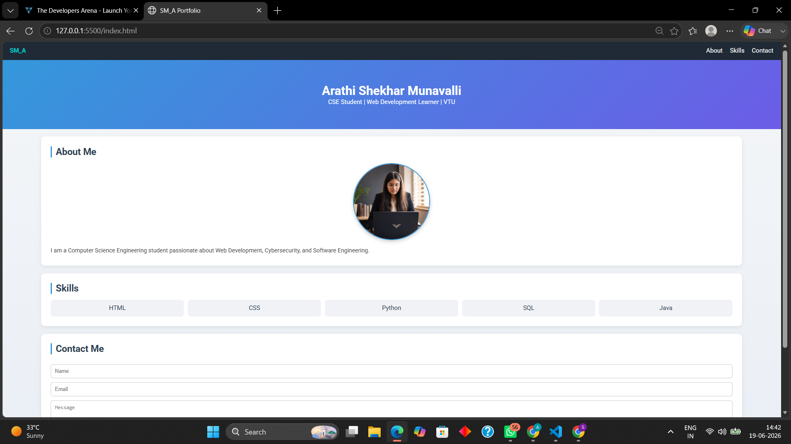
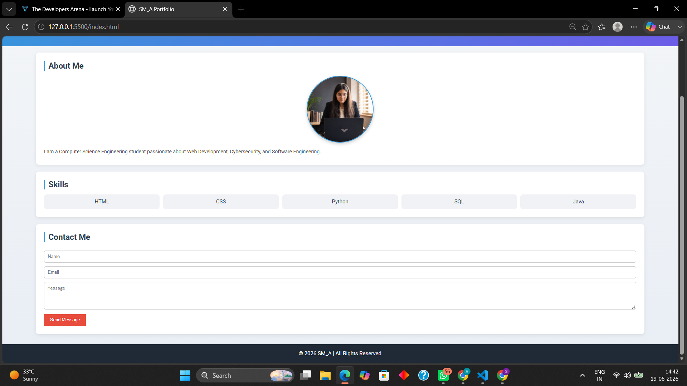

# Personal Portfolio Website
## Project Overview
This is a personal portfolio website built using HTML5 and CSS3.
It showcases the developer's profile, technical skills, and provides
a contact form for visitors to get in touch. This week the project was
updated by separating the styling into its own CSS file and making the
layout responsive.

## Features
- About Section with profile photo and personal introduction
- Skills Section listing technical skills as styled boxes
- Contact Form with Name, Email, and Message fields
- Navigation Menu with anchor links to each section
- Gradient header banner
- Card-style sections with shadows and rounded corners
- Hover effects on navigation links and the Send Message button
- Responsive layout that adjusts to different screen sizes
- Footer with copyright information

## Technologies Used
- HTML5
- CSS3

## How to Run
1. Download or clone the repository
2. Make sure the `images/` folder contains `profile.jpg`
3. Open `index.html` in any web browser

## Project Structure
```
Portfolio-Website_week2/
│
├── index.html
├── style.css
├── README.md
├── ARATHI S M.pdf
├── about-skills.png
├── contact-footer.png
└── images/
    └── profile.jpg
```

## CSS Concepts Used
- Flexbox (navigation bar and skills layout)
- Media queries for responsiveness
- Linear gradient background on the header
- `border-radius` and `box-shadow` for card-style sections
- `:hover` effects on links and buttons
- Box model and spacing using `margin` and `padding`

## Concepts Learned
- HTML Document Structure (`<!DOCTYPE html>`, `<html>`, `<head>`, `<body>`)
- Semantic Tags (`<header>`, `<nav>`, `<main>`, `<section>`, `<footer>`)
- Navigation with Anchor Links (`<a href="#section-id">`)
- Images (``)
- Lists (`<ul>`, `<li>`)
- Forms (`<form>`, `<input>`, `<textarea>`, `<button>`, `<label>`)
- Accessibility attributes (`lang`, `charset`, `alt`, `for`, `id`)
- Linking an external stylesheet with `<link rel="stylesheet">`
- Responsive design basics with media queries

## Screenshots
Header, navigation, and About Me section:



Skills grid, Contact form, and footer:



## Documentation
Full project documentation (overview, setup, code structure, technical details, testing evidence) is available in `ARATHI S M.pdf`.

## Author
Arathi S M

© 2026 Arathi S M. All Rights Reserved.
